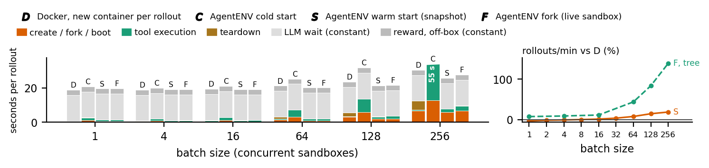
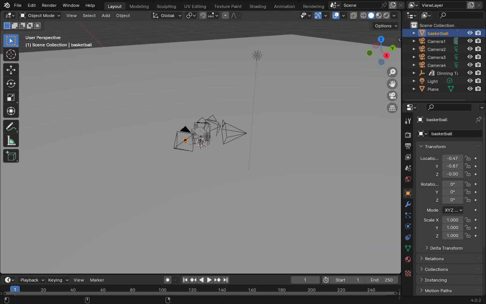
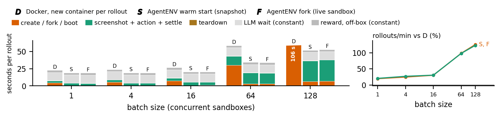
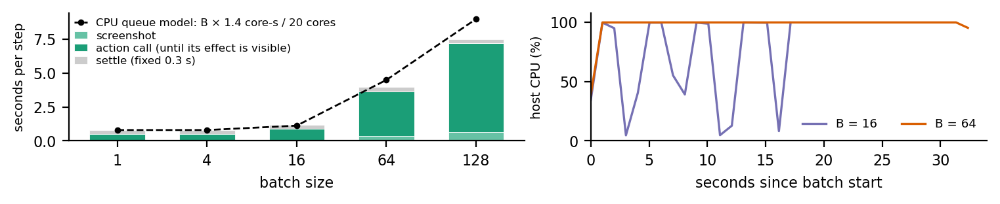

# MitoBox on Kimi AgentENV: key results

*spark00: 20-core aarch64 DGX Spark, 119 GB unified memory*

## 1. AgentENV features and SWE-bench results

- [AgentENV](https://github.com/kvcache-ai/AgentENV) is the open-source sandbox service used for Kimi K3's agentic RL. It provides one Firecracker microVM per sandbox through an E2B-compatible API and stores every disk and memory image as copy-on-write layers.
- **Two restore methods.** Both use the same restore procedure: a pre-spawned VM, with memory pages loaded on demand from one shared host copy.
    - **Warm start from a snapshot (S).** A snapshot checkpoints a sandbox (memory + disk) once, in advance. Each rollout restores a new sandbox from it, replacing boot + task setup for states known in advance, such as a GRPO group at step 0.
    - **Fork of a live sandbox (F).** Fork captures a running sandbox and restores N children while the source keeps running. It replaces prefix replay in N new sandboxes for states available only at run time, such as branching within a trajectory (tree rollouts).
- **Cold start (C)** boots a new VM from the container image without a snapshot. **Pause/resume** releases RAM and CPU during the LLM wait (not evaluated here).

**Experiment**

- **Workload.** A SWE-bench Verified task django 10880 rollout has 5 agent steps. Each step is a 3 s LLM wait followed by one shell tool call. Step 4 applies the fix. B rollouts start together on all 20 cores, B = 1 to 256, 3 rounds per point.
- **Docker baseline (D).** Each rollout uses a new container. We prepare the image with `docker commit` after running the task's tests once in a container, preserving build products and caches. We take the AgentENV snapshot at the same point. A rollout uses `docker run`, one `docker exec` per tool call, then `docker rm`. This is the strongest container baseline, but a Docker image stores only files, not running processes.
- **Tree rollouts.** One trunk runs 3 steps (tests in the third), then B branches run 3 more steps each. D and S must first replay the trunk in every branch. F forks the trunk (B = 256: 1 round).
- **Fixed times.** The LLM wait (15 s) and reward time (3 s) are constants. The LLM and reward computation run on other servers, as in most RL systems: judges on GPU clusters, test-based rewards in a separate or forked evaluation sandbox.
- **Verification.** Every rollout is verified by its final diff hash. The official grader marked that diff resolved. Of 8,817 rollouts, the only failures are 9 cold starts whose sandbox did not start.

*Figure 1. Left: median rollout time by phase. Bars cut at the axis limit show their totals. Right: rollouts/min relative to D, for S at step 0 and F in tree rollouts.*

**Results**

- **Docker (D) matches AgentENV at small batches.** For rollouts starting at step 0, performance is within 4% up to B = 16. A command-line (CLI) sandbox is ready in 0.2 to 0.7 s on either system, compared with 15 s of LLM wait.
- **Warm start (S) benefits large batches only.** Throughput gains over D are +8% (B = 64), +15% (128), +19% (256). At B = 128, Docker's creation and removal bursts take 3.1 s + 2.0 s per rollout, compared with AgentENV's 1.9 s + 0.06 s.
- **Fork (F) matches warm start at step 0** up to B = 128 (within 2 points). At 256 its gain over D is smaller (+10% against +19%). Each fork call allows at most 100 children, so we issued 4 sequential calls. Tool calls in forked sandboxes were also slower (2.8 s against 1.8 s per rollout).
- **Fork (F) improves tree rollout throughput.** All branches are ready in 0.6 to 2.5 s, compared with 3 to 27 s for replay up to B = 128 (6.9 s versus 56 s at 256). Rollouts/min increase over D by **+8% to +11% (B ≤ 16), +44% (64), +84% (128), +139% (256)**.
- **Cold start (C) is slower than Docker.** It is 6% to 15% slower up to B = 64, 23% at 128, 44% at 256, where it needs 80 GB. It also uses the original, unprepared image.
- **Tool calls are slower on AgentENV.** At B = 128, a tool call takes 0.12 s (p95 1.0 s), compared with 0.07 s (p95 0.13 s) on Docker.
- **Capacity (one probe).** After raising the kernel's `ublk` device limit, 511 of 512 CLI sandboxes ran in 22 GB. The default device limit, 64, allows about 60 sandboxes.

## 2. Blender computer-use agents (CUAs) on AgentENV

- **AgentENV requires changes on this host to run Blender's GUI.** It runs the GUI after these three changes:
    - **A 20-line server patch** (`AENV_STATIC_CPU_CONFIG_PATH`) enables SVE/PAC features that AgentENV's default guest CPU does not provide. Without them, Blender's GUI crashes with an illegal instruction.
    - **A GUI template.** AgentENV never runs the image entrypoint, so the template's start command launches a virtual X server (Xvfb), Blender and our screenshot/action server. The capture preserves these running processes. A *task snapshot* with the scene loaded is the reset point.
    - **A proxy client** connects to the in-guest server through AgentENV's HTTP proxy.
- **Display support.** Firecracker has no display device. The guest runs the GUI on Xvfb using software OpenGL. Right: the 1280×800 PNG an agent sees 1 s after sandbox restore.
- **Restore and readiness.** Warm start and fork work unchanged because they capture the whole VM without requiring the application to participate. Readiness requires *Blender to answer*, not merely *the API to return*.

**Experiment**

- **Workload.** A BlenderGym `placement1` rollout has 4 steps. Each step is screenshot → 3 s LLM wait → action → state check → 0.3 s settle. Steps 1 and 3 use real mouse and keyboard input (click, A, G, X, "0.05", Enter). Steps 2 and 4 use `blender_python` calls.
- **Docker baseline (D).** As in section 1, each rollout uses a new container. The image stores Blender and task files but no running Blender process. Each container therefore boots Xvfb + Blender and loads the task.
- **Coverage.** B = 1 to 128, one round per point. All 639 rollouts are verified against expected object positions. Cold start was not run because it adds a VM boot to D's GUI boot.

*Figure 2. Same layout and methods as Figure 1 (no cold start).*

**Results**

- **Warm start (S) removes GUI boot time.** Throughput gains over D from the task snapshot grow with batch size: **+20% (B = 1), +30% (16), +99% (64), +125% (128)**. Fork (F) performs the same.
    - A Docker GUI sandbox that starts alone is ready in 4.5 s. Readiness takes 7.6 s at B = 16, 30 s at 64 and 67 s at 128. Each boot costs about 10 core-seconds, so concurrent boots queue on the 20 cores. AgentENV needs 0.7 / 0.9 / 3.2 / 6.6 s, respectively.
- **Shared snapshot pages increase GUI sandbox density.** For 128 sandboxes, AgentENV needs 25 GB compared with Docker's 66 GB.

## 3. Discussion of the Blender results

- CPU queueing of software-rendered GUI work makes Figure 2's green phase (screenshot + action + settle) longer as batch size increases.
    - **Step cost.** In one sandbox without contention (4 vCPUs), a screenshot costs 0.05 core-seconds, a `blender_python` edit plus redraw costs 0.5 core-seconds, and a mouse and keyboard action (a click and 5 key events) costs 2.2 core-seconds in 0.8 s of wall time. After every input event, Blender redraws its whole 1280×800 interface with software OpenGL on all 4 vCPUs.
    - **Average cost.** Rollouts alternate the two action types, averaging about 1.4 core-seconds per step and about 5.6 core-seconds per rollout of 4 steps.
    - **Synchronized actions.** The fixed 3 s LLM latency makes all B sandboxes act at the same moment. At B = 16 the host CPU reaches 100% for about 2 s each step and is mostly idle between steps. From B = 64 it remains at 100% throughout the batch (Figure 3, right).
    - **Queue model and measurements.** The model, step time = B × 1.4 core-seconds / 20 cores, predicts 1.1 s (B = 16), 4.5 s (64) and 9.0 s (128). Measured times are 1.2 s, 4.0 s and 7.5 s, respectively (Figure 3, left).
    - **Step components.** The action call, measured until its effect is visible in Blender's state, grows the most (Figure 3, left). This growth is a GUI cost, not a sandbox management cost, and the green phase also grows on Docker.
- **Throughput limit.** The measured cost of 5.6 core-seconds per rollout gives a computed upper limit of about 210 rollouts of 4 steps per minute on 20 cores, for any sandbox system. We measured 140 rollouts/min for warm start at B = 128. Restore costs about 1 core-second per sandbox, against about 10 for a Docker GUI boot, determining how much CPU remains available for steps.
- **GUI and CLI results in Figures 1 and 2 differ for two reasons.**
    - **Prepared state.** A CLI task's prepared state is files, which a Docker image stores. A GUI task's is a running application and display server, which an image cannot store. Thus D matches AgentENV up to B = 16 in Figure 1 but is slower at every batch size in Figure 2.
    - **Startup time.** GUI boot takes 20× as long (4.5 s against 0.2 s), so warm start and fork benefit GUI rollouts from B = 1 (CLI from B ≥ 32).

*Figure 3. Left: mean time per GUI step by component for S, with the CPU queue model. Right: host CPU use over time for S at B = 16 and B = 64.*
